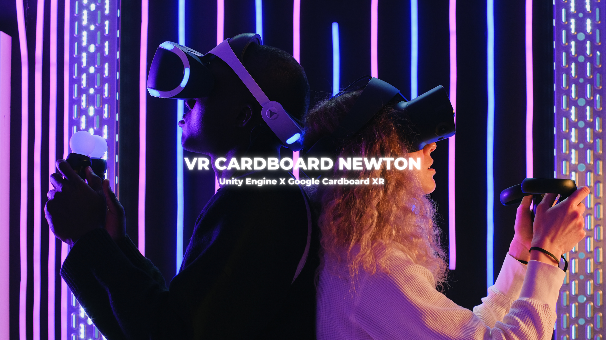
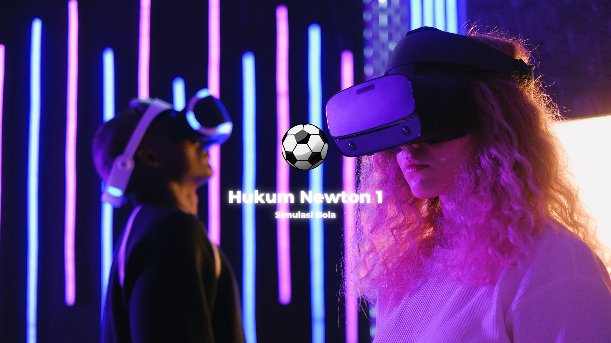
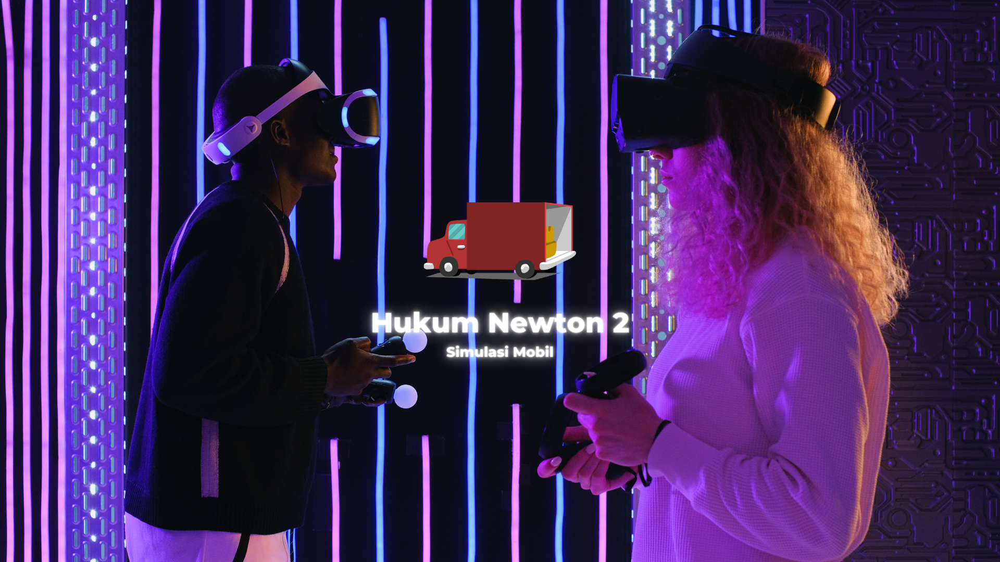
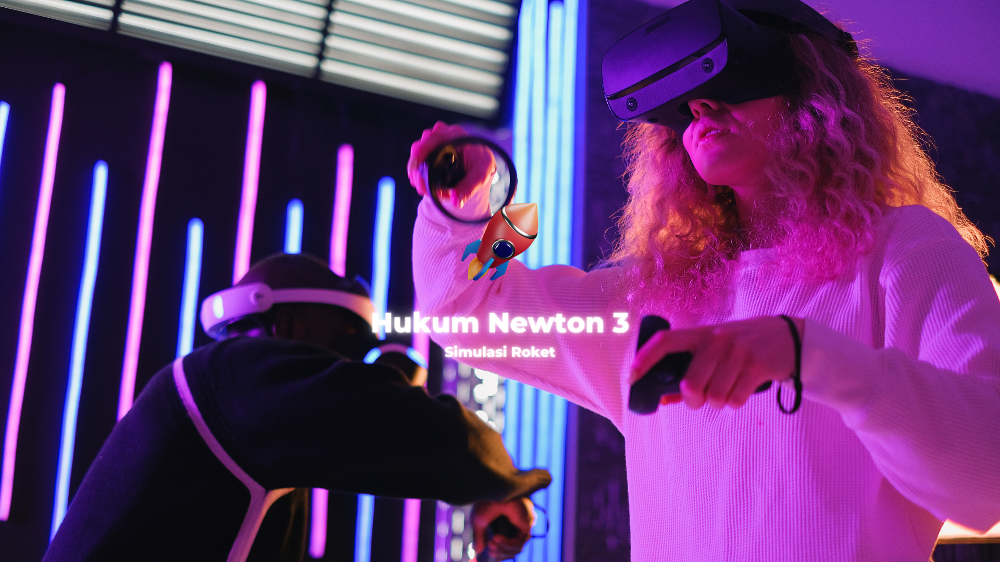
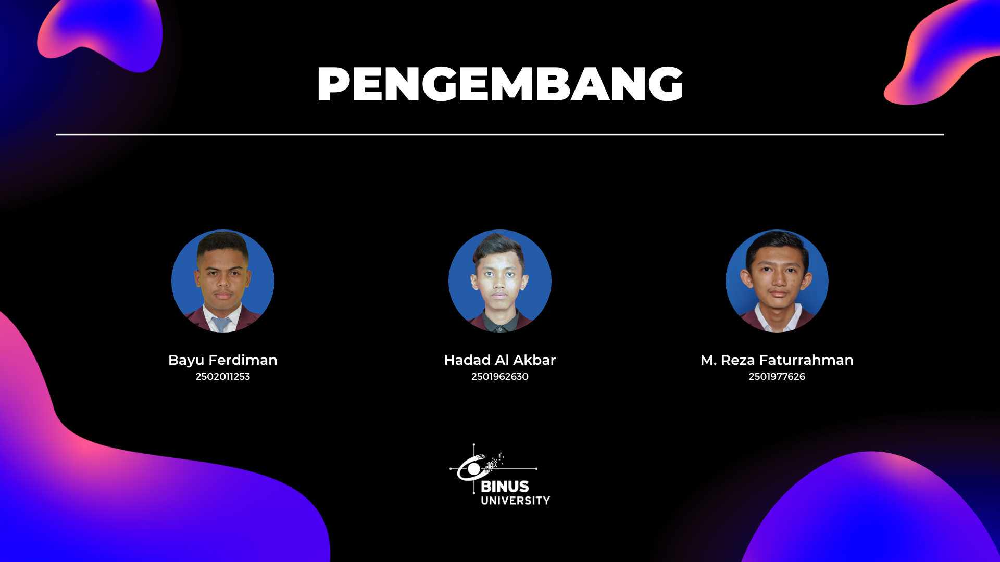

# VR Cardboard Newton - Unity

Proyek VR Cardboard Hukum Newton 1, 2, dan 3 memiliki tujuan untuk memvisualisasikan dan mempelajari konsep-konsep dalam Hukum Newton melalui penggunaan teknologi Virtual Reality (VR). Proyek ini menggunakan game engine Unity dan SDK Google Cardboard XR untuk menciptakan pengalaman VR yang interaktif.

## 3D Model

Nantinya, akan terdapat 3 simulasi yang tersedia dan 3D model yang digunakan adalah sebagai berikut:

- Bola,
- Mobil, dan
- Roket.

Sumber 3D Model :
- [Free Sports Kit](https://assetstore.unity.com/packages/3d/characters/free-sports-kit-239377)
- [Vehicle](https://learn.unity.com/tutorial/set-up-your-first-project-in-unity?uv=2021.3&projectId=5caccdfbedbc2a3cef0efe63)
- [Meshtint Free City Lite Pack Mega Toon Series](https://assetstore.unity.com/packages/3d/environments/urban/meshtint-free-city-lite-pack-mega-toon-series-152378)
- [Atom Rocket Model](https://assetstore.unity.com/packages/3d/vehicles/space/atom-rocket-model-140021)
- [Particle Pack](https://assetstore.unity.com/packages/vfx/particles/particle-pack-127325)
- [Simple Low Poly Nature Pack](https://assetstore.unity.com/packages/3d/environments/landscapes/simple-low-poly-nature-pack-157552)
- [Low Poly Park](https://assetstore.unity.com/packages/3d/environments/low-poly-park-154815)
- [Stylized Snow Forest](https://assetstore.unity.com/packages/3d/environments/landscapes/stylized-snow-forest-230653)
- [Low Poly Environment Pack](https://assetstore.unity.com/packages/3d/environments/landscapes/lowpoly-environment-pack-99479)

## Simulasi Hukum Newton 1, 2, dan 3

Pada **Hukum Newton 1**, pengguna akan diberikan perintah untuk mendorong bola. Interaksi ini akan memberikan perintah yang membuat bola dapat bergerak ke depan dengan cara ketika user mengarahkan pandangan atau pointer pada bola, maka bola tersebut akan bergerak ke depan. Setelah bola bergerak, pengguna dapat melihat penjelasan dari bagaimana bola tersebut dapat bergerak sesuai dengan Hukum Newton 1. Nantinya, pengguna akan diuji dengan kuis untuk memastikan pengguna sudah memahami atau belum.

Pada **Hukum Newton 2**, pengguna akan diberikan perintah untuk menekan tombol mulai atau mobil box untuk dapat menggerakkan mobil box dengan kecepatan yang didapatkan dari gaya dibagi massa. Interaksi ini akan memberikan perintah yang membuat mobil box dapat bergerak dengan cara ketika user mengarahkan pandangan atau pointer pada tombol mulai atau mobil box, maka mobil box tersebut akan bergerak. Setelah mobil box bergerak, pengguna dapat melihat penjelasan dari bagaimana mobil box tersebut dapat bergerak sesuai dengan Hukum Newton 2. Nantinya, pengguna akan diuji dengan kuis untuk memastikan pengguna sudah memahami atau belum.

Pada **Hukum Newton 3**, pengguna akan diberikan perintah untuk menekan tombol mulai. Interaksi ini akan memberikan perintah yang membuat roket dapat meluncur dengan cara ketika user mengarahkan pandangan atau pointer pada tombol mulai, maka roket tersebut akan meluncur dengan hitungan mundur. Setelah roket meluncur, pengguna dapat melihat penjelasan dari bagaimana roket tersebut dapat meluncur sesuai dengan Hukum Newton 3. Nantinya, pengguna akan diuji dengan kuis untuk memastikan pengguna sudah memahami atau belum.

## Rencana Pengembangan

- Proyek Awal. ✅
- Menambahkan Scene Home, dan Main Menu. ✅
- Menambahkan Scene Simulasi Hukum Newton 1. ✅
- Menambahkan Scene Simulasi Hukum Newton 2. ✅
- Menambahkan Scene Simulasi Hukum Newton 3. ✅
- Mengubah Icon atau Logo dan Versi Aplikasi. ✅

## Mockup

Figma : [Wireframes + Mockup](https://www.figma.com/file/2NT8LuHNpwqFd7WBBgrulR/VR-Newton's-Law?type=design&node-id=0%3A1&t=69xmXBd8wwoOVjEH-1)

## Aplikasi

v1.0 : [Download](https://drive.google.com/file/d/1AJngkl76EdL63Os9pPpz9vh3ApJ2DbXY/view?usp=sharing)

## Persyaratan Sistem

- Minimal Android 8 "Oreo".

## Demo

YouTube : [Klik Disini](https://youtu.be/Fb-XcPpr-kE)

## Pengembang

